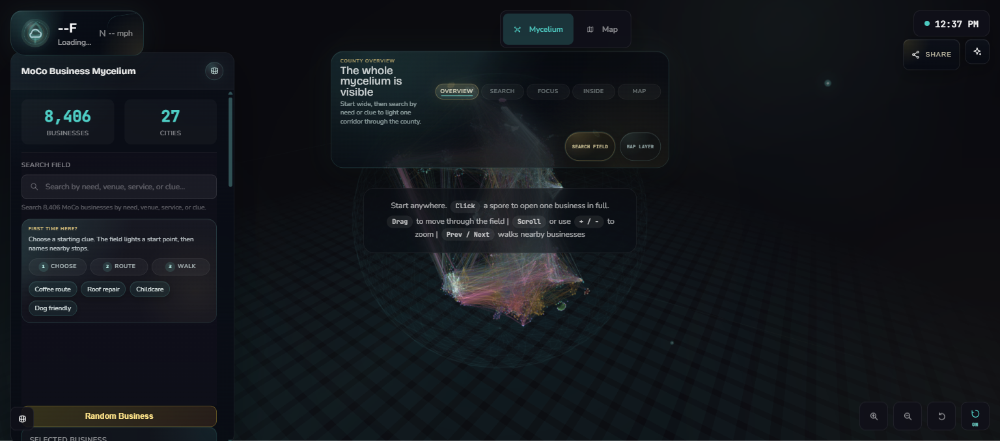
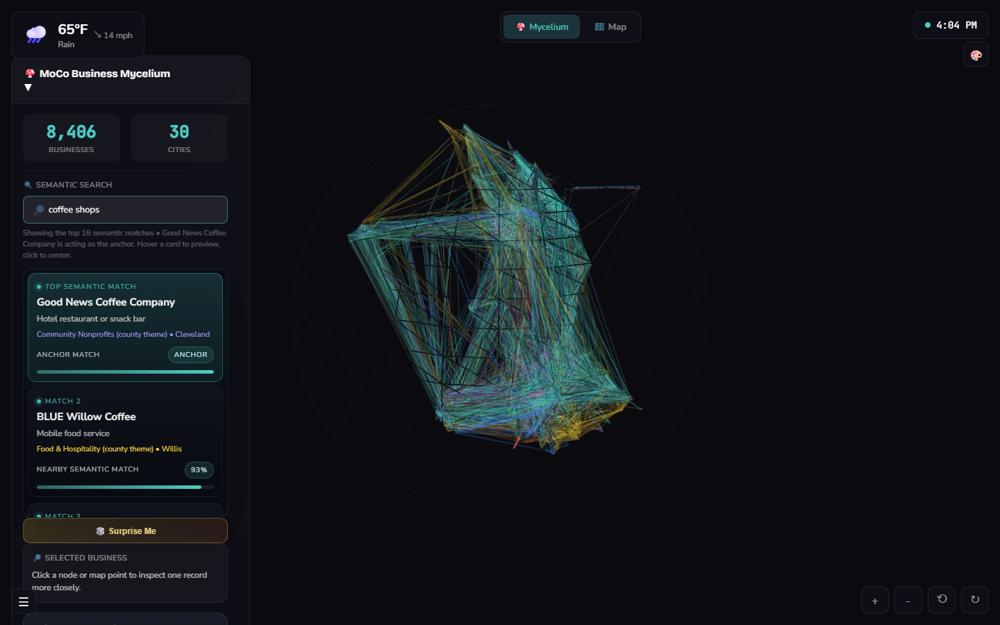
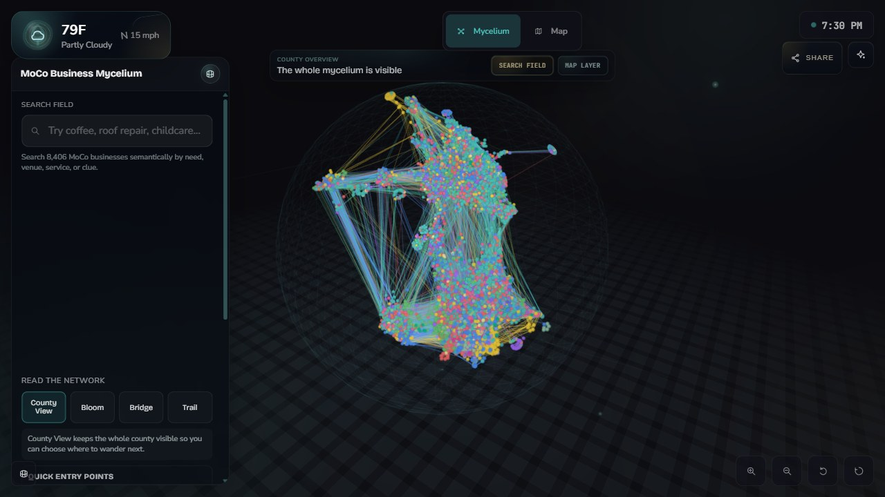

# Semantic Business Search Explorer

Semantic retrieval surface for 8,406 Montgomery County business records.

**Live demo:** https://mccullough.cloud/semantic-demo/

This project turns local-business embeddings into a browser-based review surface: clustered records, search focus, semantic neighbor trails, map anchors, responsive HUD controls, and a backend artifact lane for the retrieval data. Three.js and Leaflet are the inspection layer; the core work is making a real semantic search corpus visible enough to audit.





## Walkthrough

[](docs/video/semantic-demo-walkthrough.mp4)

Unmute for narration. This 61-second walkthrough shows the core flow: county context, need-based search, a focused semantic neighborhood, map handoff, and return to the same network position.

## Overview

This project provides an interactive environment for exploring high-dimensional semantic search over a real local-business corpus. It combines a compact public record payload with generated semantic-neighbor artifacts so retrieval behavior can be inspected in the browser instead of hidden behind a text-only search box.

## Features

- **Interactive Corpus Navigation:** Pan, zoom, rotate, search, and inspect 8,406 business records in a semantic constellation.
- **Semantic Clustering:** Visual grouping and color-coding of related business records based on embedded proximity and factual modifiers.
- **Cinematic Camera Choreography:** Smooth, orchestrated camera movements that guide the user through the data landscape.
- **High-Performance Rendering:** Built with HTML/CSS/JavaScript, Three.js, and Leaflet for a web-based corpus inspection experience.
- **Responsive UI:** A tailored heads-up display (HUD) that adapts to desktop and mobile form factors.

## Architecture Highlights

- **Three.js Core:** Utilizes custom shaders and instanced rendering for optimal performance.
- **Vector Mapping:** `data.dat` and the semantic thread artifacts are loaded to represent corpus records and retrieval relationships.
- **Relationship Rendering:** Instanced particles, proximity-based glow, and routed connection lines make semantic neighborhoods inspectable.
- **Semantic Backend:** The tracked `backend/` files contain the public Python surface used to build, prepare, restore, and serve semantic search artifacts. Local LeadOps and mailbox-era scripts are ignored from the portfolio surface so the published repo stays focused on retrieval infrastructure.

## Demo

This project was built as a working browser prototype. The default demo runs from static files; the tracked backend scripts document how the semantic artifacts are generated and can serve local search during development. For local review, run a simple web server and open the served `index.html`; direct `file://` loading can block the `.dat` artifact fetches in some browsers.

```bash
python -m http.server 5190
```

Then visit `http://127.0.0.1:5190/index.html`. The page loads `semantic-demo.css` and the associated `.dat` files for the structural mappings.

## Data Boundary

The public demo uses a compact business-record payload derived from public Montgomery County business records and generated semantic artifacts. It is intended as a corpus-inspection demo, not a private contact database. Lead notes, outreach logs, mailbox data, and operational CRM state are outside the published demo payload.

## Proof Artifacts

| Artifact | What it shows |
| --- | --- |
| `index.html` | Full browser experience and interaction model |
| `data.dat` | Compact public record payload generated from semantic thread artifacts |
| `semantic-demo.css` | Responsive UI, HUD styling, search/focus states, and motion polish |
| `backend/` | Tracked semantic artifact generation and local search service path behind the visualization |
| `docs/video/semantic-demo-walkthrough.mp4` | Guided 61-second walkthrough with narration and the Motion409 v5 neighborhood proof frame |

## Recruiter Reading Guide

Run the local server and open `index.html` first to inspect the interaction model, then `semantic-demo.css` for the UI polish and responsiveness. The backend folder is intentionally included to show how the visualization connects to generated semantic artifacts rather than being only a decorative 3D page.
