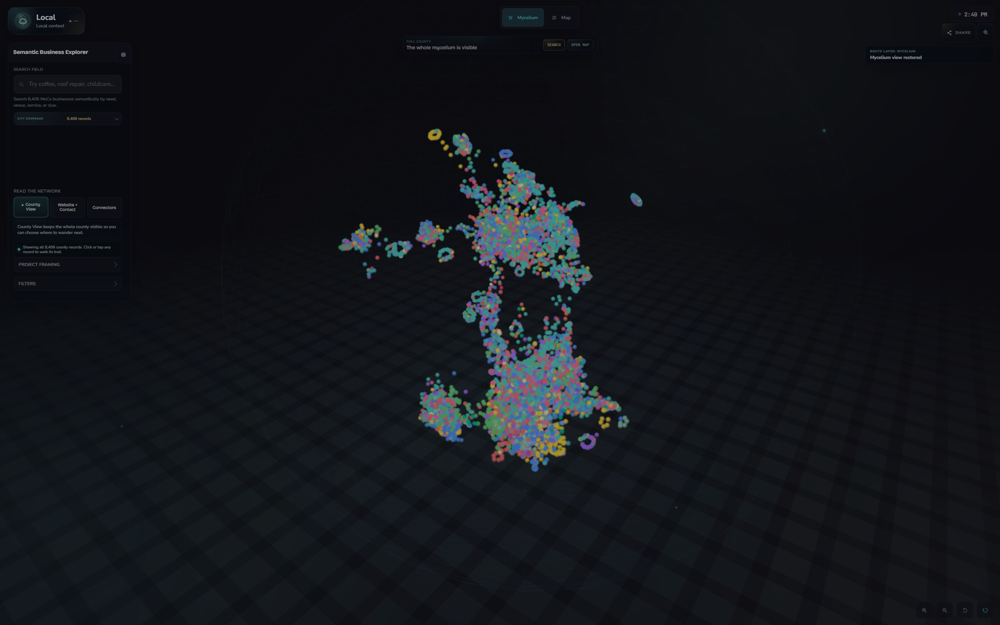
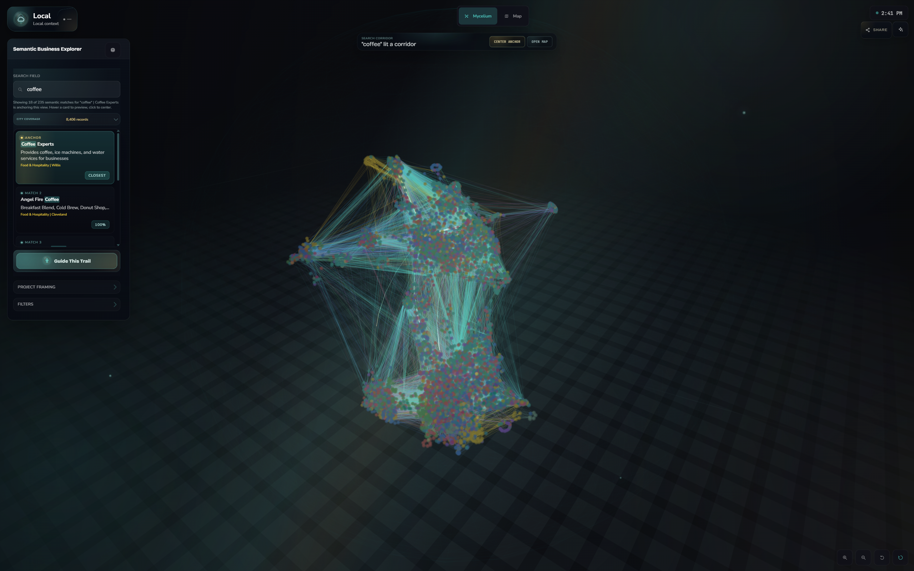
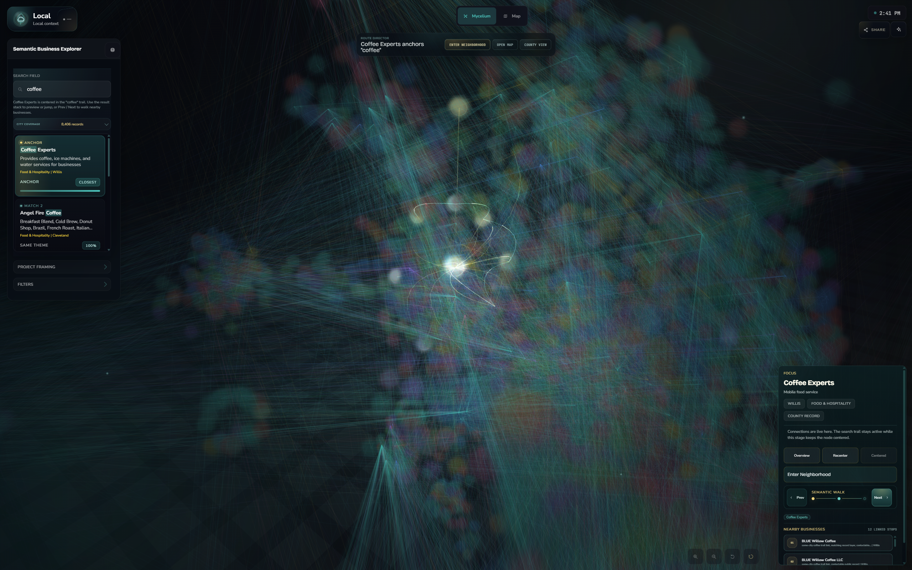
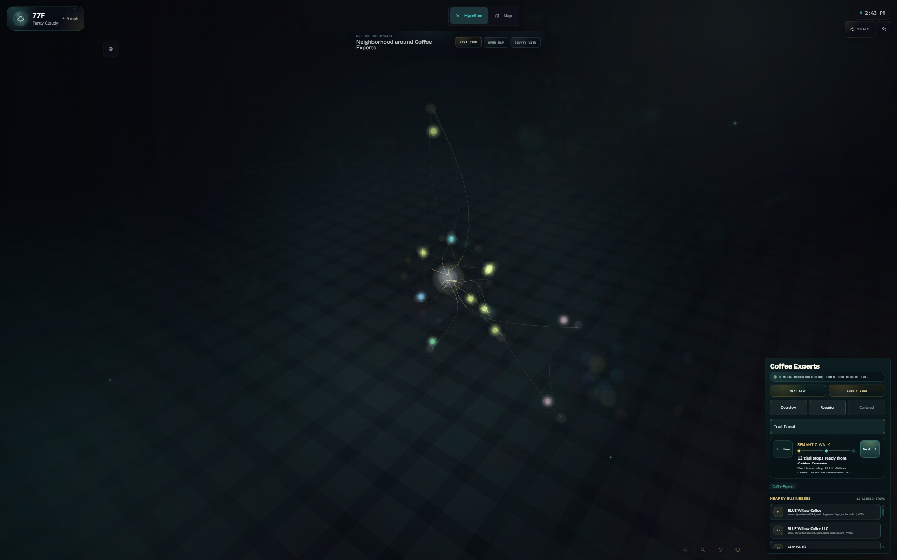
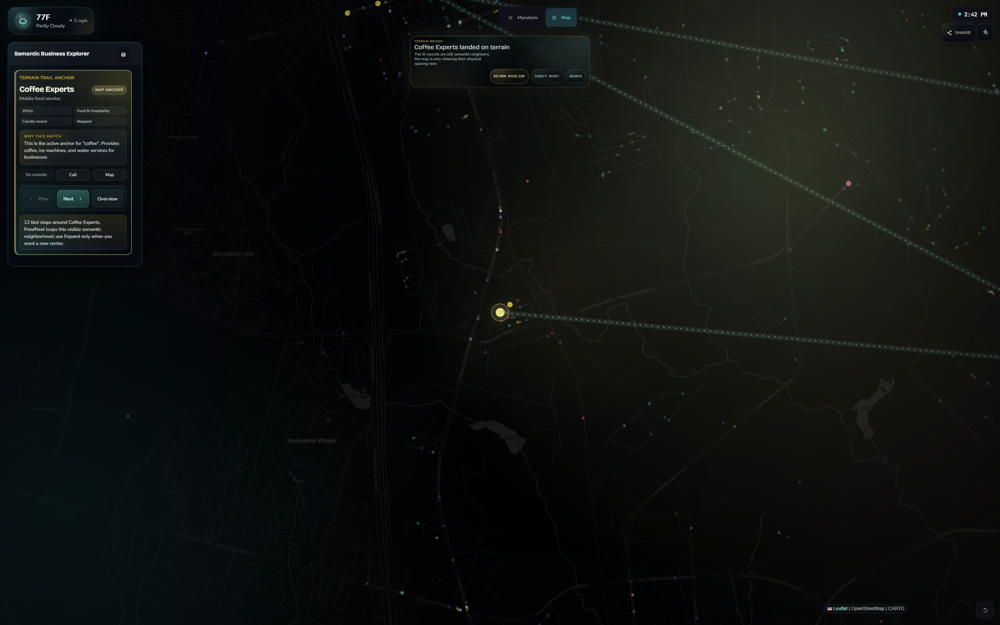

# Montgomery County Semantic Explorer

Developed by [Fred McCullough](https://github.com/GalToast)

**Interactive Three.js explorer for inspecting semantic search relationships.**

This project turns embedding-based similarity across 8,406 publicly available Montgomery County business records into a browser-based visual surface. It supports concept-based discovery, neighborhood inspection, and map handoff without reducing the work to a flat directory.

The corrected [LinkedIn announcement](https://www.linkedin.com/feed/update/urn:li:ugcPost:7457881427901140993/) uses this same live screenshot set; the project proof is preserved directly below for readers who arrive through GitHub first.

## The Throughline

I build systems that turn messy real-world data into inspectable workflows. This project demonstrates how embedding-based retrieval can be made visible and navigable, allowing users to walk a semantic neighborhood and carry a focused result into map context.

## Features

- **Interactive 3D Navigation:** Pan, zoom, and rotate through a dynamically generated semantic constellation.
- **Concept-Based Discovery:** Visual grouping and color-coding of semantically related data points (e.g., "coffee shops," "law firms") based on vector proximity.
- **Guided Camera Choreography:** Smooth camera movement that keeps selected records and nearest-neighbor trails understandable.
- **High-Performance Rendering:** Built on Three.js for smooth web-based 3D graphics, even with thousands of data points.
- **Responsive HUD:** A tailored heads-up display that provides real-time metadata for the focused semantic neighborhood.

## Architecture Highlights

- **Three.js Core:** Utilizes custom shaders and instanced rendering for optimal performance.
- **Vector Mapping:** Pre-computed semantic threads are loaded and visualized to represent data relationships.
- **Dynamic Physics:** Custom particle physics and glow effects keep the dense graph readable while preserving the sense of a live network.
- **Semantic Backend:** The `backend/` directory contains the Python pipeline used to generate and serve embeddings and nearest-neighbor artifacts.
- **Local Model Cache Layer:** The live Hostinger deployment includes a guarded local inference worker that precomputes cached "Deep trail note" artifacts for selected semantic trails. Public visitors only read cached artifacts through a read-only API path; cache misses fall back silently to deterministic guide copy instead of starting large-model generation.

## Live Case Study

For a deep dive into the engineering decisions and systems mindset behind this project, see the [McCullough Digital systems page](https://mccullough.digital/systems/) or follow the [LinkedIn announcement](https://www.linkedin.com/feed/update/urn:li:ugcPost:7457881427901140993/).

## Proof Artifacts

| Artifact | What it shows |
| --- | --- |
| `index.html` | Full browser experience and interaction model |
| `semantic-demo.css` | Responsive UI, HUD styling, search/focus states, and motion polish |
| `backend/` | Semantic artifact generation path behind the visualization |
