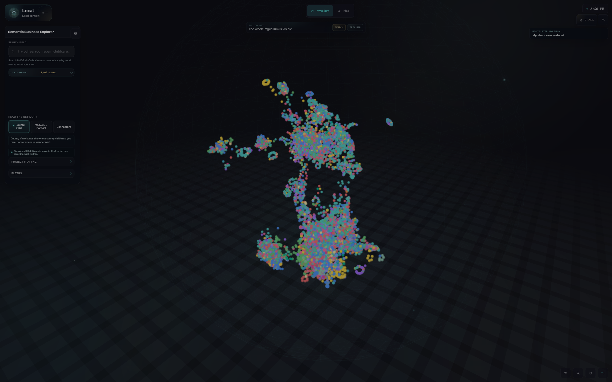
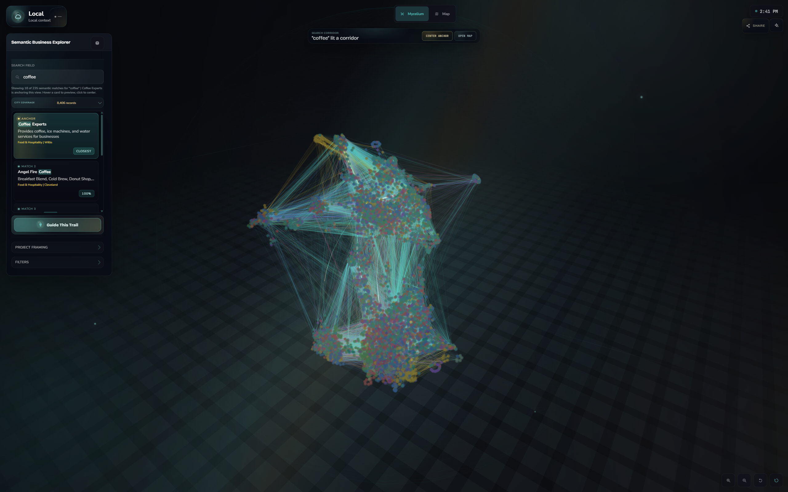
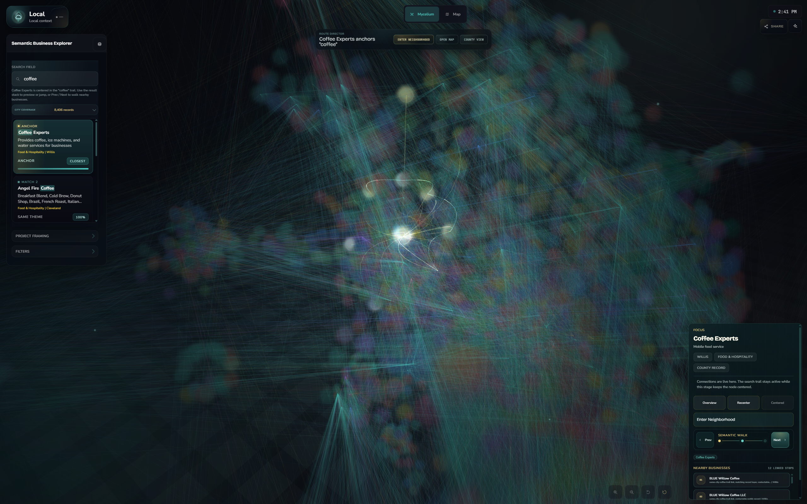
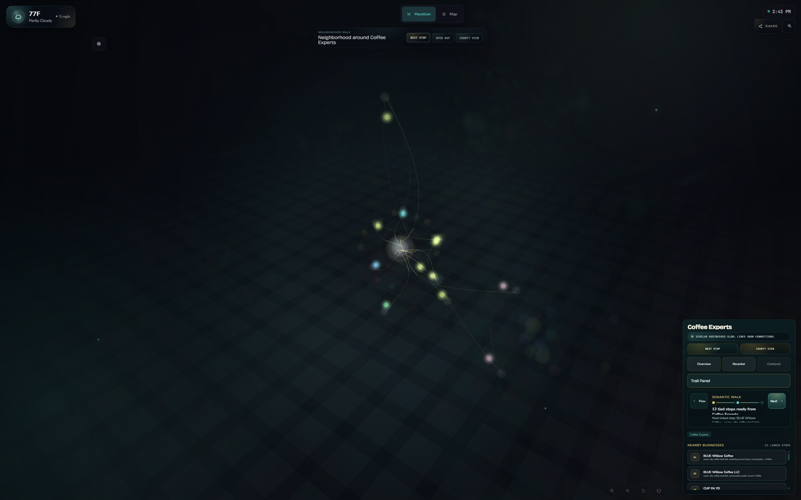
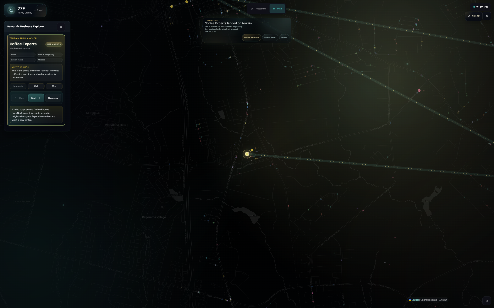

# Montgomery County Semantic Explorer

Developed by [Fred McCullough](https://github.com/GalToast)

**Interactive Three.js explorer for inspecting semantic search relationships.**

## Quickstart

```bash
python3 -m http.server 8000
# then open http://localhost:8000
```

Opening `index.html` directly via `file://` does not work — the `.dat` data files require HTTP.

This project turns embedding-based similarity across 8,406 publicly available Montgomery County business records into a browser-based visual surface. It supports concept-based discovery, neighborhood inspection, and map handoff without reducing the work to a flat directory.

The corrected [LinkedIn announcement](https://www.linkedin.com/feed/update/urn:li:ugcPost:7457881427901140993/) uses this same live screenshot set; the project proof is preserved directly below for readers who arrive through GitHub first.











## The Throughline

I build systems that turn messy real-world data into inspectable workflows. This project demonstrates how embedding-based retrieval can be made visible and navigable, allowing users to walk a semantic neighborhood and carry a focused result into map context.

## Features

- **Interactive 3D Navigation:** Pan, zoom, and rotate through a dynamically generated semantic constellation.
- **Concept-Based Discovery:** Visual grouping and color-coding of semantically related data points (e.g., "coffee shops," "law firms") based on vector proximity.
- **Guided Camera Choreography:** Smooth camera movement that keeps selected records and nearest-neighbor trails understandable.
- **High-Performance Rendering:** Built on Three.js for smooth web-based 3D graphics, even with thousands of data points.
- **Responsive HUD:** A tailored heads-up display that provides real-time metadata for the focused semantic neighborhood.

## Architecture Highlights

- **Three.js Core:** Utilizes custom shaders and instanced rendering for optimal performance.
- **Vector Mapping:** Pre-computed semantic threads are loaded and visualized to represent data relationships.
- **Dynamic Physics:** Custom particle physics and glow effects keep the dense graph readable while preserving the sense of a live network.
- **Semantic Backend:** The `backend/` directory contains the Python pipeline used to generate and serve embeddings and nearest-neighbor artifacts.
- **Local Model Cache Layer:** The former Hostinger deployment (taken down when the mccullough.digital and mccullough.cloud domains lapsed on 2026-09-24) ran a guarded local inference worker that precomputed cached "Deep trail note" artifacts for selected semantic trails. Public visitors only read cached artifacts through a read-only API path; cache misses fell back silently to deterministic guide copy instead of starting large-model generation.

## Walkthrough

There is no hosted video in this repo. What exists: a poster still (`docs/video/semantic-demo-walkthrough-poster.jpg`), beat-by-beat notes for the walkthrough in `docs/video/`, and the [LinkedIn announcement](https://www.linkedin.com/feed/update/urn:li:ugcPost:7457881427901140993/), which is the closest public walkthrough. The [McCullough Digital systems page](https://mccullough.digital/systems/) previously linked here is dead — the domain lapsed on 2026-09-24.

## What Works From a Static Clone

Everything in this repo renders the full 3D explorer over the committed `.dat` files: `index.html` loads the 8,406 business records (`data.dat`) and the precomputed semantic threads (`semantic_threads.dat`, `semantic_threads_ui.dat`) and works offline apart from one gap — the UI also calls six `api.php` actions that existed only on the former Hostinger deployment and are not in this repo. Without them, the page still loads and degrades gracefully, but with real limits: free-text search (`semantic_search`) fails with "Semantic search is unavailable right now." and has no client-side fallback; the guide summary card (`semantic_guide`) still shows a deterministic summary generated in the browser; cached "Deep trail note" narration (`semantic_trail_story`) is silently hidden; per-record enriched context on the selected-business card (`lead_context`) is skipped, so the card shows only what is already in the `.dat` files; and the search-service probes (`semantic_lane_health`, `semantic_lane_ops_summary`) never fire from a static clone — on non-production hosts the health check short-circuits to a local "Static demo mode" placeholder. The offline Python generation pipeline in `backend/` can rebuild the artifacts, but the PHP read API behind those six actions was never committed.

## Proof Artifacts

| Artifact | What it shows |
| --- | --- |
| `index.html` | Full browser experience and interaction model |
| `semantic-demo.css` | Responsive UI, HUD styling, search/focus states, and motion polish |
| `backend/` | Semantic artifact generation path behind the visualization |
